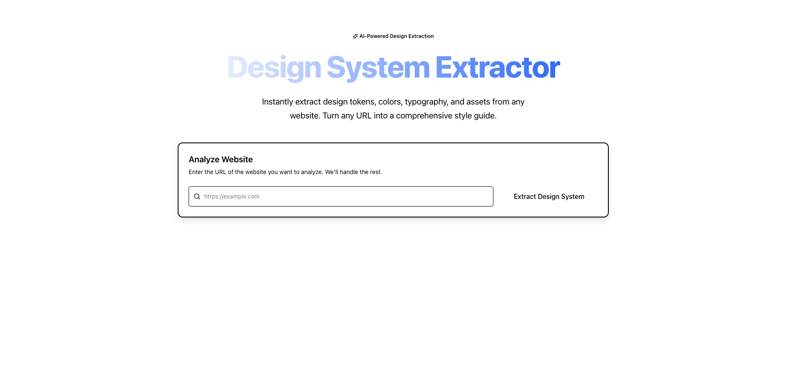
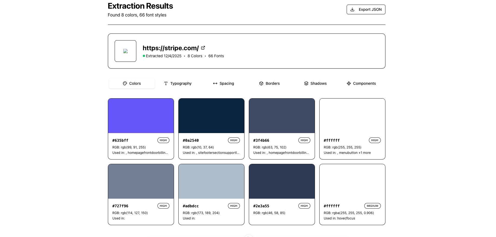

# Extypo - Design System Extractor

Extypo is a powerful SaaS application built with Nuxt 4 that allows you to extract, visualize, and export design systems from any website. Powered by `dembrandt` and `shadcn-vue`, it provides a professional interface to analyze branding, colors, typography, and components.

## Features

- 🎨 **Design System Extraction**: Automatically extract colors, typography, spacing, borders, shadows, and more from any URL.
- 👁️ **Visual Preview**: Interactive preview of extracted design tokens using a tabbed interface.
- 📱 **Component Analysis**: Detects and visualizes button styles, inputs, and other UI components.
- 📤 **JSON Export**: Export the full design system configuration for use in your own projects.
- ⚡ **Modern Tech Stack**: Built with Nuxt 4, Tailwind CSS, and shadcn-vue for a polished, responsive UI.

## Screenshots


_Enter a URL to start extracting_


_Visualized design tokens including colors and typography_

## Tech Stack

- **Framework**: [Nuxt 4](https://nuxt.com)
- **UI Library**: [shadcn-vue](https://www.shadcn-vue.com) (Radix Vue + Tailwind CSS)
- **Styling**: Tailwind CSS v3.4
- **Extraction Engine**: [dembrandt](https://github.com/bon-org/dembrandt) (Playwright-based)
- **Icons**: Lucide Vue

## Getting Started

### Prerequisites

- Node.js (v18 or higher)
- pnpm (recommended) or npm/yarn

### Installation

1. Clone the repository:
   ```bash
   git clone <repository-url>
   cd extypo
   ```

2. Install dependencies:
   ```bash
   pnpm install
   ```

3. Install Playwright browsers (required for extraction):
   ```bash
   npx playwright install chromium
   ```

### Development

Start the development server:

```bash
pnpm dev
```

The application will be available at `http://localhost:3000`.

### Usage

1. Enter a valid URL (e.g., `https://example.com`) in the input field.
2. Click "Extract Design System".
3. Wait for the analysis to complete (this may take a few seconds as it spins up a headless browser).
4. Explore the extracted design tokens in the tabs below (Colors, Typography, Spacing, etc.).
5. Click "Export JSON" to download the raw data.

## Project Structure

- `app/pages/index.vue`: Main application page with extraction logic and UI.
- `server/api/extract.post.ts`: Backend API endpoint that handles the `dembrandt` extraction process.
- `components/DesignSystemPreview.vue`: Component for visualizing the extracted data.
- `components/ui/`: Reusable UI components (Button, Input, Card, etc.) built with shadcn-vue.
- `tailwind.config.js`: Tailwind configuration with custom animations and shadcn defaults.

## License

MIT
